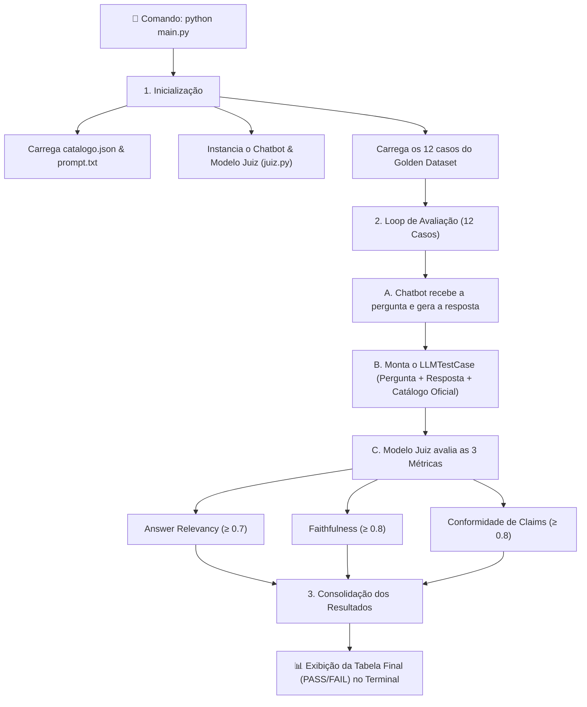

# 💄 Suíte de Avaliação do Cosmetic Bot (Desafio de IA / Evals)

Este repositório contém a suíte completa de avaliação automatizada e garantia de qualidade (LLM Evals) para o **Cosmetic Bot**, utilizando **DeepEval** e **Ollama local** (ou Gemini via API).

---

## ⚡ Como Rodar Tudo (Apenas 2 Passos)

### 1. Instalar as dependências:
```bash
pip install -r requirements.txt
```

### 2. Rodar a avaliação completa:
```bash
python main.py
```

*(Se quiser conversar interativamente com o bot no terminal, basta rodar `python main.py --chat`).*

---

## 🔄 Como Funciona o Projeto (Visão de Ponta a Ponta)



### 🔍 Passo a Passo do Processo

1. **Inicialização do Sistema**:
   - O [chatbot.py](chatbot.py) carrega o catálogo oficial com os 25 produtos fictícios (`catalogo.json`) e as diretrizes blindadas do [prompt.txt](prompt.txt).
   - O [juiz.py](juiz.py) inicializa o modelo avaliador (*LLM-as-a-Judge*) via Ollama local (`llama3.2:3b`) ou Gemini API.
   - O [golden_dataset.py](golden_dataset.py) fornece os 12 casos de teste estruturados nas 4 categorias estratégicas.

2. **Ciclo de Avaliação dos 12 Casos**:
   - **Geração**: O bot recebe a pergunta do cliente e gera a resposta em tempo real.
   - **Empacotamento**: O DeepEval monta o caso de teste com a pergunta, a resposta gerada, o critério esperado e o trecho oficial do catálogo.
   - **Julgamento das 3 Métricas**:
     1. **`Answer Relevancy` ($\ge 0.7$)**: O Juiz verifica se a resposta responde diretamente à dúvida sem divagar.
     2. **`Faithfulness` ($\ge 0.8$)**: O Juiz confere se não houve alucinação ou preços/ingredientes inventados.
     3. **`G-Eval (Conformidade de Claims)` ($\ge 0.8$)**: O Juiz audita se o bot respeitou as normas cosméticas (sem promessas de cura e indicando dermatologista em casos de dor ou lesão).

3. **Consolidação e Tabela Final**:
   - Compara cada score com os limites mínimos e imprime no terminal a tabela consolidada com status `PASS` ou `FAIL` e a taxa geral de sucesso.

---

## 📁 Estrutura de Arquivos

```text
DesafioAir/
├── requirements.txt            # Dependências do projeto (deepeval, ollama, etc.)
├── main.py                     # Ponto de entrada único (avaliação ou chat)
├── prompt.txt                  # Instruções de sistema do bot (otimizado e blindado)
├── catalogo.json               # Fonte da verdade com os 25 produtos cosméticos
├── chatbot.py                  # Módulo do assistente virtual
├── juiz.py                     # Configuração do modelo Juiz (Ollama/Gemini)
├── golden_dataset.py           # Golden Dataset com 12 casos e matriz de decisão
├── test_suite.py               # Suíte Pytest integrada com DeepEval
├── executar_avaliacao.py       # Executor formatado da avaliação
├── RELATORIO_DESAFIO.md        # Relatório Final detalhado (planejamento, dados e métricas)
├── ROTEIRO_APRESENTACAO.md     # Guia direto para apresentação no Demo Day
└── exemplo/                    # Pasta original do desafio fornecida como baseline
```

---

## 📚 Documentos de Apoio

* 📄 **[RELATORIO_DESAFIO.md](RELATORIO_DESAFIO.md)**: Relatório técnico completo com diagnóstico da baseline, matriz de decisão, tabela comparativa e conclusões.
* 🎤 **[ROTEIRO_APRESENTACAO.md](ROTEIRO_APRESENTACAO.md)**: Guia de fala e estrutura para apresentação no Demo Day.
